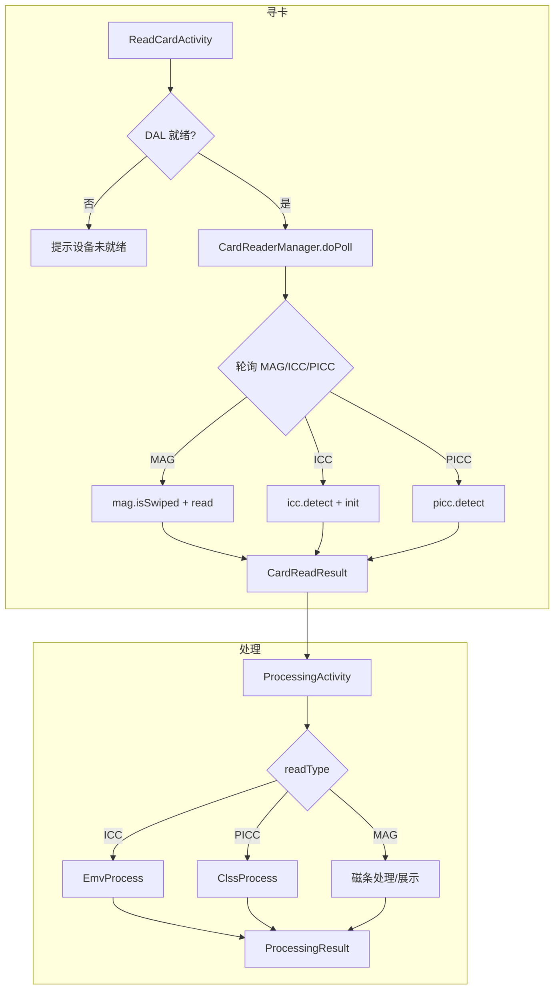

# 寻卡与卡片处理问题修复计划

**问题描述**: 应用执行后无法正常的寻卡并进行卡片的处理。

**Code Review 结论**（基于 [CardReaderManager.java](app/src/main/java/com/payment/demo/card/CardReaderManager.java)、[ReadCardActivity.java](app/src/main/java/com/payment/demo/ui/ReadCardActivity.java)、[ProcessingActivity.java](app/src/main/java/com/payment/demo/ui/ProcessingActivity.java)）：

---

## 一、寻卡问题（CardReaderManager）

### 1.1 仅检测 PICC，未检测 ICC 和 MAG

**现状**: `doPoll()` 中仅对 `(mode & EReaderType.PICC)` 做检测，ICC 和 MAG 完全未实现。

```java
// 当前仅此分支
if ((mode & EReaderType.PICC.getEReaderType()) == EReaderType.PICC.getEReaderType()) {
    PiccCardInfo info = piccInternal.detect(EDetectMode.EMV_AB);
    ...
}
```

**影响**: 插卡（ICC）、刷磁条（MAG）无法被识别，用户只能通过挥卡（PICC）读卡。

**参考实现**:
- [PiccDetectModel](Reference_Project/JemvDemo2.0/app/src/main/java/com/paxsz/demo/emvdemo/trans/mvp/detectcard/PiccDetectModel.java): 轮询 MAG → ICC → PICC
- [MagDetectModel](Reference_Project/JemvDemo2.0/app/src/main/java/com/paxsz/demo/emvdemo/trans/mvp/detectcard/MagDetectModel.java): `mag.isSwiped()` + `mag.read()`
- [IccDetectModel](Reference_Project/JemvDemo2.0/app/src/main/java/com/paxsz/demo/emvdemo/trans/mvp/detectcard/IccDetectModel.java): `icc.detect()` + `icc.init()`

### 1.2 可选：使用 ICardReaderHelper.polling()

**现状**: JemvDemo2.0 的 [NeptunePollingPresenter](Reference_Project/JemvDemo2.0/app/src/main/java/com/paxsz/demo/emvdemo/trans/mvp/detectcard/NeptunePollingPresenter.java) 使用 `getDal().getCardReaderHelper().polling(readType, timeout)` 统一处理 PICC/ICC/MAG。

**建议**: 若 IDAL 提供 `getCardReaderHelper()`，可优先采用该 API 简化实现；否则按 1.1 扩展手动轮询。

### 1.3 init 阶段可能触发 native 崩溃

**现状**: `piccInternal.close()` / `piccInternal.open()` 在首次调用时可能加载 DeviceConfig，若设备缺少 libDeviceConfig.so 会崩溃。已用 try/catch 捕获并返回 RET_INIT_FAILED，但 `readersOpened` 在 catch 前未置 true，safeCloseReaders 不会执行，逻辑正确。

**建议**: 保持现有宽容失败策略；若采用 ICardReaderHelper.polling()，可避免直接调用 picc/icc/mag 的 open/close，降低触发路径。

---

## 二、DAL 初始化时序

**现状**: [PaymentDemoApp](app/src/main/java/com/payment/demo/app/PaymentDemoApp.java) 在 `backgroundExecutor` 中异步初始化 DAL，`getDal()` 在 `dalInitDone` 前返回 null。

**影响**: 用户快速输入金额进入读卡页时，DAL 可能尚未就绪，导致 `RET_INIT_FAILED`。

**建议**:
- 在主入口跳转读卡页前，等待 `dalInitDone` 并检查 `getDal() != null`；若为 null，提示“设备未就绪”并阻止跳转。
- 或在 ReadCardActivity 启动时若 getDal() 为 null，延迟 500ms 重试一次，再失败则展示 RET_INIT_FAILED。

---

## 三、卡片处理问题（ProcessingActivity）

**现状**: [ProcessingActivity](app/src/main/java/com/payment/demo/ui/ProcessingActivity.java) 使用 `runEmvPlaceholder()` 直接返回成功，未调用 EmvProcess/ClssProcess。

**影响**: 读卡成功后无法进行真实 EMV 流程（应用选择、读数据、CVM、脚本等），无法与卡片进行 APDU 交互。

**根因**: tasks.md 中 **T013** 未完成。

**建议**: 按 [research.md](specs/001-payment-demo/research.md) §8 后续实施建议完成 T013：
1. 新建 `app/src/main/java/.../emv/` 包，封装 EmvProcess/ClssProcess 调用
2. 改造 ProcessingActivity，根据 readType（ICC/PICC/MAG）选择 EmvProcess 或 ClssProcess
3. 处理 EMV 回调（应用选择、PIN、在线授权、脚本等）
4. 确保 assets 中有有效 EMV 参数

---

## 四、实施步骤与优先级

| 优先级 | 任务 | 说明 |
|--------|------|------|
| P1 | 扩展 CardReaderManager 支持 ICC、MAG | 参考 MagDetectModel、IccDetectModel，在 doPoll 中增加 MAG、ICC 轮询 |
| P1 | 或改用 ICardReaderHelper.polling() | 若 IDAL 提供，可替代手动轮询，需验证 API 可用性 |
| P2 | 主入口/读卡页 DAL 就绪校验 | 跳转前等待 dalInitDone，getDal() 为 null 时提示并阻止 |
| P2 | 完成 T013：EMV 处理封装 | 改造 ProcessingActivity 调用 EmvProcess/ClssProcess |

---

## 五、流程图（修复后）



---

## 六、文档同步

- 更新 [tasks.md](specs/001-payment-demo/tasks.md)：T017 备注修正为“读卡模块当前仅检测 PICC，需补充 ICC、MAG”
- 更新 [research.md](specs/001-payment-demo/research.md)：增加“寻卡与处理问题修复”决策记录
